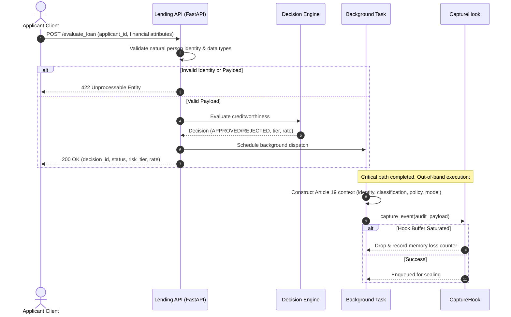

# Technical Design: Lending API

## Overview
The Lending API is an enterprise microservice built using FastAPI and Pydantic. It provides an automated credit evaluation service that processes loan applications deterministically in sub-5ms latency, validates natural person identity, enriches audit records with EU AI Act Article 19 context, and safely dispatches records out-of-band to the `autonomous-lending-capture-hook` without entering the critical customer response path.

### Goals
- Expose a clean, strongly-typed RESTful interface for loan evaluation (`POST /evaluate_loan`).
- Strictly validate applicant identity to enforce natural human status and reject machine credentials.
- Evaluate creditworthiness deterministically using credit scores, income, and debt ratios.
- Assemble mandatory EU AI Act Article 19 context (`identity`, `data_classification`, `policy_version`, `model_version`).
- Asynchronously dispatch events to `autonomous-lending-capture-hook` with zero critical-path latency and fail-open guarantees.
- Provide health and metrics endpoints (`GET /health`, `GET /stats`).

### Non-Goals
- Real ML model training or complex non-deterministic inference pipelines.
- Long-term database persistence of loan contracts.
- In-process cryptographic signing (fully delegated to `autonomous-lending-capture-hook`).

## Boundary Commitments

### This Spec Owns
- HTTP request/response handling, routing, and error formatting.
- Input validation models and natural person identity guards.
- Algorithmic credit decision logic and explainability reason codes.
- Out-of-band background task scheduling and error isolation.
- Operational metrics counters for loan evaluations and dispatch health.

### Out of Boundary
- Canonical CBOR serialization, SHA-256 hashing, Ed25519/ML-DSA-65 signatures, and Merkle tree manipulation (owned by `autonomous-lending-capture-hook`).
- Offline receipt verification and mathematical proof checking (owned by `verifier`).

### Allowed Dependencies
- `fastapi`: ASGI web framework.
- `pydantic`: Type validation and schema parsing.
- `autonomous_lending_capture_hook`: Installed project package providing `CaptureHook`.

### Revalidation Triggers
- Alterations to `CaptureHook.capture_event` parameter signatures or queue contracts.
- Changes to EU AI Act Article 19 required field names.

## Architecture

### Architecture Pattern & Boundary Map

```mermaid
flowchart TD
    subgraph ClientLayer ["Client Ingestion"]
        Client[Loan Applicant / Frontend]
    end

    subgraph LendingAPIBoundary ["Lending API Service (FastAPI)"]
        Router["HTTP Router (/evaluate_loan)"]
        Validator["Pydantic Validator (Natural Person Guard)"]
        Engine["Credit Decision Engine"]
        AuditBuilder["Article 19 Audit Payload Builder"]
        BgDispatcher["Async Background Dispatcher"]
        MetricsCollector["Metrics & Observability (/stats)"]
    end

    subgraph CoreEngineBoundary ["autonomous-lending-capture-hook (Out-of-Band)"]
        CaptureHookQueue[Async Ingestion Queue]
        WorkerThread[Cryptographic Sealing Worker]
    end

    Client -->|POST /evaluate_loan| Router
    Router --> Validator
    Validator -->|Validated Request| Engine
    Engine -->|Decision Result| Router
    Router -->|Immediate HTTP 200| Client

    Router -.->|Enqueue Background Task| BgDispatcher
    BgDispatcher --> AuditBuilder
    AuditBuilder -->|Article 19 Audit Event| CaptureHookQueue
    CaptureHookQueue --> WorkerThread
    Router --> MetricsCollector
```



### Technology Stack
| Layer | Choice / Version | Role in Feature | Notes |
|---|---|---|---|
| Web Framework | FastAPI 0.115+ | REST API & Background Tasks | Native async, high throughput |
| Data Validation | Pydantic v2 | Schema validation & Identity rules | Strict typing & validation |
| Server / ASGI | Uvicorn 0.30+ | ASGI production server | Standard Python ASGI runtime |
| Evidence Capture | `autonomous_lending_capture_hook` | Out-of-band cryptographic engine | Local package dependency |

## File Structure Plan

### Directory Structure
```
src/
└── lending_api/
    ├── __init__.py           # Package exports
    ├── models.py             # Pydantic schemas (LoanRequest, LoanResponse, AuditContext)
    ├── decision.py           # Deterministic credit scoring and risk-tier algorithm
    ├── audit.py              # Article 19 payload builder & async hook dispatcher
    └── main.py               # FastAPI application, lifecycle management, routes
tests/
└── test_lending_api.py       # Comprehensive API tests using httpx.AsyncClient / TestClient
```

## System Flows



## Requirements Traceability

| Requirement ID | Summary | Components | Interfaces |
|---|---|---|---|
| 1.1 | Natural person identity validation & rejection of machine IDs | `models.py` | `LoanApplicationRequest` validator |
| 1.2 | Ingestion of financial attributes and HTTP 200 response | `main.py`, `models.py` | `POST /evaluate_loan` |
| 1.3 | Error response with HTTP 422 on invalid schema | `main.py`, `models.py` | FastAPI validation exception handler |
| 1.4 | Response attributes (`decision_id`, `status`, `risk_tier`, etc.) | `models.py` | `LoanEvaluationResponse` |
| 2.1 | Algorithmic rejection on low credit score / excessive debt | `decision.py` | `evaluate_credit_risk()` |
| 2.2 | Algorithmic approval with tier-based interest rate | `decision.py` | `evaluate_credit_risk()` |
| 2.3 | Ingestion of 4 mandatory Article 19 fields | `audit.py`, `models.py` | `build_article_19_audit_record()` |
| 2.4 | Enforce mandatory fields before dispatch | `audit.py` | `dispatch_audit_event()` |
| 3.1 | Out-of-band audit payload construction | `audit.py` | `build_article_19_audit_record()` |
| 3.2 | Asynchronous background dispatch | `main.py`, `audit.py` | `fastapi.BackgroundTasks` |
| 3.3 | Fail-open resilience on saturated buffer | `audit.py` | Exception catching & metrics bump |
| 3.4 | Zero latency overhead on client response | `main.py` | Background execution model |
| 4.1 | Operational readiness health endpoint | `main.py` | `GET /health` |
| 4.2 | Application metrics endpoint | `main.py` | `GET /stats` |

## Components and Interfaces

### Component 1: `models.py` (Validation & Schemas)
- **Natural Person Guard**:
  ```python
  import re
  from pydantic import BaseModel, Field, field_validator

  REJECTED_PREFIXES = ("svc:", "client:", "oauth:", "bot:", "system:", "service_account:")

  class LoanApplicationRequest(BaseModel):
      applicant_id: str = Field(..., min_length=6, max_length=64)
      name: str = Field(..., min_length=2, max_length=100)
      annual_income: float = Field(..., gt=0)
      requested_amount: float = Field(..., gt=0)
      credit_score: int = Field(..., ge=300, le=850)

      @field_validator("applicant_id")
      def validate_natural_person(cls, v: str) -> str:
          v_clean = v.strip().lower()
          for prefix in REJECTED_PREFIXES:
              if v_clean.startswith(prefix):
                  raise ValueError("applicant_id must represent a natural human person; machine/service accounts are prohibited under EU AI Act Article 19")
          return v
  ```

### Component 2: `decision.py` (Deterministic Underwriting)
- **Algorithm**:
  - If `credit_score < 600`: `REJECTED`, reason: `"CREDIT_SCORE_BELOW_THRESHOLD"`, risk tier: `"HIGH"`.
  - If `requested_amount > (annual_income * 0.6)`: `REJECTED`, reason: `"EXCESSIVE_DEBT_TO_INCOME"`, risk tier: `"HIGH"`.
  - Else: `APPROVED`, risk tiers:
    - `credit_score >= 750`: `"PRIME"` (Rate: 5.5%)
    - `credit_score >= 670`: `"NEAR_PRIME"` (Rate: 7.9%)
    - `credit_score >= 600`: `"SUBPRIME"` (Rate: 11.5%)

### Component 3: `audit.py` (Article 19 Builder & Dispatcher)
- Constructs the immutable dictionary matching `autonomous_lending_capture_hook.payload.py`:
  ```python
  def build_article_19_audit_record(
      request: LoanApplicationRequest,
      decision: LoanEvaluationResponse
  ) -> dict:
      return {
          "identity": request.applicant_id,
          "data_classification": "PII_FINANCIAL_RECORDS",
          "policy_version": "POLICY-CREDIT-2026.1",
          "model_version": "MODEL-CREDIT-EVAL-v1.4",
          "applicant_name": request.name,
          "annual_income": request.annual_income,
          "requested_amount": request.requested_amount,
          "credit_score": request.credit_score,
          "decision_id": decision.decision_id,
          "status": decision.status,
          "risk_tier": decision.risk_tier,
          "interest_rate": decision.interest_rate,
          "rejection_reason": decision.rejection_reason,
          "timestamp": decision.timestamp
      }
  ```
- Non-blocking fail-open dispatcher:
  ```python
  async def dispatch_audit_event(hook: CaptureHook, record: dict):
      try:
          await hook.capture_event(record)
      except Exception as ex:
          # Fail-open: log error, increment drop metric, never crash
          logger.warning(f"Failed to dispatch audit record: {ex}")
  ```

### Component 4: `main.py` (FastAPI App & Lifespan)
- Lifespan initializes `CaptureHook(queue_maxsize=1000)` and ensures workers stop gracefully on shutdown.
- Routes:
  - `POST /evaluate_loan`
  - `GET /health`
  - `GET /stats`

## Error Handling
- **422 Unprocessable Entity**: When client provides malformed JSON, invalid numbers, or a non-human identity.
- **500 Internal Server Error**: Any unhandled internal failure.
- **Hook Saturation**: Catches queue drops internally without returning 500 to the client (fail-open guarantee).

## Testing Strategy
- **Unit Tests**:
  - Validation of `applicant_id` rejecting `svc:*`, `client:*`, etc., and accepting citizen IDs.
  - Deterministic evaluation branches for all credit score and debt-to-income tiers.
  - Article 19 payload generator verifying presence and format of all 4 required audit fields.
- **Integration Tests**:
  - `POST /evaluate_loan` end-to-end evaluation with `httpx.AsyncClient`.
  - Background task trigger verifying that `CaptureHook` receives the audit record without slowing down the HTTP response.
  - Verifying `GET /health` and `GET /stats` reflect accurate operational counts.
