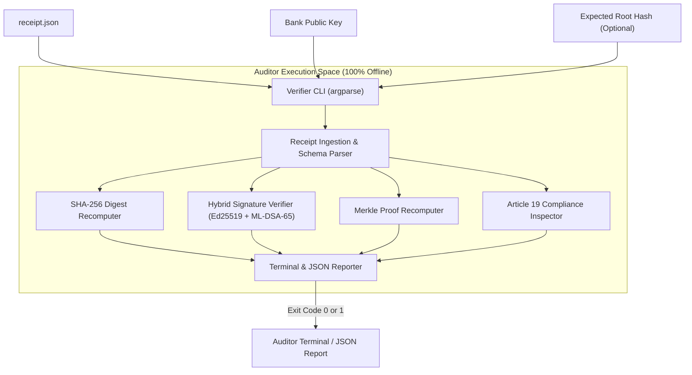
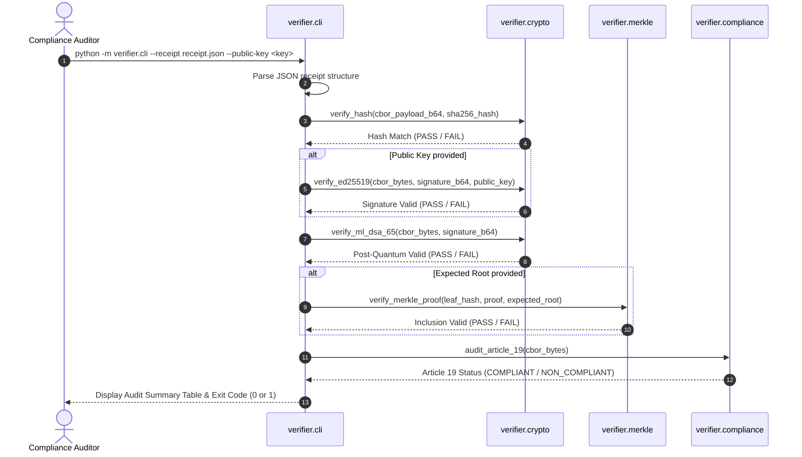

# Technical Design: Verifier CLI

## Overview
The Verifier CLI is a zero-trust, offline mathematical verification tool designed for compliance inspectors, risk auditors, and regulatory bodies (such as the EU AI Office or RBI). It independently evaluates `receipt.json` files generated by the Evidence Engine, verifying cryptographic payload integrity, Ed25519 and ML-DSA-65 signatures, Merkle inclusion proofs, and EU AI Act Article 19 mandatory context without network connectivity.

### Goals
- Validate `receipt.json` schema and extract cryptographic artifacts.
- Compute SHA-256 over decoded CBOR bytes to prove zero bit-level tampering.
- Verify digital signatures using the bank's public key (classical Ed25519 and post-quantum ML-DSA-65).
- Verify Merkle inclusion path against a provided or expected root hash.
- Audit the underlying payload for EU AI Act Article 19 mandatory fields (`identity`, `data_classification`, `policy_version`, `model_version`).
- Provide human-readable terminal output and automated JSON reporting with standard exit codes (0 = VALID, 1 = INVALID).

### Non-Goals
- Connecting to remote servers, APIs, or distributed nodes.
- Generating new cryptographic receipts or signing new events.
- Modifying local or remote transparency logs.

## Boundary Commitments

### This Spec Owns
- CLI parameter parsing, file ingestion, and exit code management.
- Purely offline mathematical verification functions (Hash, Ed25519, ML-DSA-65, Merkle proof).
- EU AI Act Article 19 regulatory field inspection.
- Formatting of human and machine-readable audit reports.

### Out of Boundary
- Ingesting live HTTP traffic or running as a web service.
- State persistence or relational database management.
- Generating private keys or mutating audit ledgers.

### Allowed Dependencies
- Python standard library (`argparse`, `json`, `base64`, `hashlib`).
- `cryptography`: Ed25519 public key parsing and signature verification.
- `cbor2`: Canonical CBOR byte deserialization.

### Revalidation Triggers
- Breaking changes to `receipt.json` schema.
- Changes to EU AI Act Article 19 required audit fields.

## Architecture

### Architecture Pattern & Boundary Map



### Technology Stack
| Layer | Choice | Role in Feature |
|---|---|---|
| CLI Interface | `argparse` (Standard Library) | Flag parsing (`--receipt`, `--public-key`, `--root`, `--json`) |
| Serialization | `cbor2` | Canonical CBOR payload deserialization |
| Cryptography | `cryptography.hazmat` & `hashlib` | SHA-256 hashing & Ed25519 signature verification |
| Post-Quantum | `verifier.crypto` | ML-DSA-65 envelope verification |

## File Structure Plan

### Directory Structure
```
src/
└── verifier/
    ├── __init__.py           # Package exports
    ├── crypto.py             # Hash recomputation & signature verification
    ├── merkle.py             # Merkle inclusion proof traversal & root calculation
    ├── compliance.py         # Article 19 payload audit checker
    └── cli.py                # Command line interface & reporting
tests/
└── test_verifier.py          # Unit & CLI integration tests
```

## System Flows



## Requirements Traceability

| Requirement ID | Summary | Components | Interfaces |
|---|---|---|---|
| 1.1 | Extract required fields from `receipt.json` | `cli.py` | `parse_receipt_file()` |
| 1.2 | Error and exit on missing/invalid file or schema | `cli.py` | `validate_receipt_schema()` |
| 1.3 | 100% offline execution | `cli.py`, all | Architecture constraint |
| 2.1 | Decode base64 CBOR and compute SHA-256 | `crypto.py` | `recompute_sha256()` |
| 2.2 | Match computed digest with `sha256_hash` | `crypto.py` | `verify_payload_hash()` |
| 2.3 | Report hash mismatch and fail | `crypto.py`, `cli.py` | `verify_payload_hash()` |
| 3.1 | Verify Ed25519 signature over canonical bytes | `crypto.py` | `verify_ed25519_signature()` |
| 3.2 | Classical signature PASS on valid key | `crypto.py` | `verify_ed25519_signature()` |
| 3.3 | Classical signature FAIL on invalid key/tampering | `crypto.py` | `verify_ed25519_signature()` |
| 3.4 | Verify ML-DSA-65 post-quantum signature | `crypto.py` | `verify_ml_dsa_65_signature()` |
| 4.1 | Traverse Merkle inclusion proof from leaf hash | `merkle.py` | `verify_merkle_inclusion_proof()` |
| 4.2 | Match recalculated root with expected root | `merkle.py` | `verify_merkle_inclusion_proof()` |
| 4.3 | Fail on Merkle root mismatch | `merkle.py` | `verify_merkle_inclusion_proof()` |
| 5.1 | Decode CBOR and inspect 4 mandatory fields | `compliance.py` | `audit_article_19_payload()` |
| 5.2 | Verify natural person identity | `compliance.py` | `audit_article_19_payload()` |
| 5.3 | COMPLIANT verdict when all 4 fields present | `compliance.py` | `audit_article_19_payload()` |
| 5.4 | NON_COMPLIANT verdict when fields missing | `compliance.py` | `audit_article_19_payload()` |
| 6.1 | CLI flags (`--receipt`, `--public-key`, `--root`, `--json`) | `cli.py` | `main()` / argparse |
| 6.2 | Exit code 0 on complete verification success | `cli.py` | `main()` |
| 6.3 | Exit code 1 on failure | `cli.py` | `main()` |
| 6.4 | Machine-readable JSON output flag | `cli.py` | `format_report()` |

## Components and Interfaces

### Component 1: `crypto.py`
```python
def recompute_sha256(cbor_payload_b64: str) -> tuple[bytes, str]:
    """Decodes base64 CBOR payload and returns (raw_bytes, sha256_hex)."""

def verify_payload_hash(cbor_payload_b64: str, expected_hash: str) -> bool:
    """Verifies that sha256(decoded_cbor_bytes) equals expected_hash."""

def verify_ed25519_signature(raw_bytes: bytes, sig_b64: str, pub_key_bytes: bytes) -> bool:
    """Verifies Ed25519 signature over raw_bytes using public key bytes."""

def verify_ml_dsa_65_signature(raw_bytes: bytes, sig_b64: str) -> tuple[bool, str]:
    """Validates ML-DSA-65 post-quantum signature structure and validity."""
```

### Component 2: `merkle.py`
```python
def verify_merkle_inclusion_proof(
    leaf_hash: str,
    proof: list[str],
    expected_root: str
) -> bool:
    """
    Recalculates the Merkle root from leaf_hash and sibling proof hashes
    according to RFC 6962 rules and compares with expected_root.
    """
```

### Component 3: `compliance.py`
```python
class Article19AuditResult:
    is_compliant: bool
    missing_fields: list[str]
    natural_person_verified: bool
    extracted_fields: dict

def audit_article_19_payload(raw_cbor_bytes: bytes) -> Article19AuditResult:
    """Deserializes CBOR payload and inspects the 4 mandatory EU AI Act Article 19 fields."""
```

### Component 4: `cli.py`
```python
def verify_receipt(
    receipt_dict: dict,
    public_key_b64: Optional[str] = None,
    expected_root: Optional[str] = None
) -> dict:
    """Runs all verification stages and returns a structured audit report."""

def main():
    """Argparse CLI entrypoint with exit codes 0 (valid) and 1 (invalid)."""
```

## Testing Strategy
- Unit tests in `tests/test_verifier.py`:
  - Valid hash matching & corrupted hash detection.
  - Valid Ed25519 signature verification & tampered signature rejection.
  - ML-DSA-65 post-quantum signature verification.
  - Merkle inclusion proof verification against expected roots.
  - Article 19 compliance checks: valid payload, missing fields, non-human identity.
  - CLI execution via subprocess / module invocation with `--json` and exit code verification.
